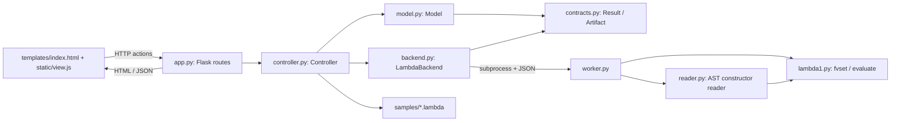

# Assignment 4: MVC architecture

## Components and responsibilities

The controller coordinates the backend. The model enforces application state
without importing Flask, HTML, or the interpreter. The view forwards actions
and presents state; it never analyzes or evaluates programs.

| Responsibility | Implementation | Boundary |
| --- | --- | --- |
| Model | `model.py`: `Model`, `StateError`; `contracts.py`: `Result`, `Artifact` | Owns applied source, name, revision, draft, results, busy action, and artifact. Rejects dirty/busy requests and invalid changes; invalidates results/artifacts on accepted source changes. No rendering or HTTP objects. |
| View | `templates/index.html`, `static/view.js`, `static/style.css` | Labeled menu/editor/buttons, busy and error text, literal results. Sends source/action requests and polls while busy. Client-side disabling mirrors model rules for usability. |
| Controller | `controller.py`: `Controller`; HTTP adaptation in `app.py` | Loads canned examples, decodes uploads, coordinates model transitions and backend methods, and publishes completion. Flask extracts request data and serializes state without language processing. |
| Backend adapter | `backend.py`: `LambdaBackend`; `worker.py`, `reader.py` | Implements replaceable language methods. Validates constructor ASTs, calls supplied free-variable analysis or evaluation, classifies diagnostics, and terminates timed-out subprocesses. |

## Load → Lint → Interpret trace

1. The view sends a canned selection or uploaded bytes through a Flask route
   to the controller. Under the model's reentrant lock, the model checks that
   no operation or unapplied edit exists. Upload decoding and source-size
   checks run before acceptance. Rejection preserves applied state.
2. Acceptance sets the source/name/draft, increments the revision, and clears
   old results and artifacts. JSON state updates the editor and controls.
3. Lint requests a model transition to busy. The controller snapshots the
   applied source and revision, starts a background thread, and immediately
   returns busy state. Conflicting requests are rejected by the model.
4. The adapter launches a worker. `reader.read_source` validates an allowlisted
   constructor AST. `lambda1.d0exp_fvset` returns a `frozenset`; no evaluation
   occurs. A closed program returns `success`. An open program such as
   `D0Evar("x")` returns `language_error`, listing x deterministically.
5. The controller verifies the result's action/revision, appends it to the
   model, and clears busy. Polling displays the result and restores controls.
6. Interpret can be requested independently of Lint, including after a Lint
   error. It uses a new worker, parses the same applied source, and calls
   `d0exp_evaluate(expression, ENVnil())`. Closed arithmetic returns a value;
   an unbound x returns `D0V000()` and is reported as `runtime_error`. A closed
   division-by-zero program also fails at runtime despite passing Lint.
7. On worker timeout/failure the controller records a diagnostic, preserves
   source, and restores idle state so the user can retry.

## Backend contract

`contracts.Backend` defines `lint(source, revision)`, `interpret(source,
revision)`, `typecheck(source, revision)`, `compile(source, revision)`, and
`execute(artifact)`. Every method returns a frozen `Result` with operation,
source revision, outcome, text, optional `frozenset` of free variables, and
optional artifact. JSON transports the set as a sorted list. Controller tests
substitute the backend through constructor injection without changing views.

| Outcome | Meaning |
| --- | --- |
| `success` | Real operation completed successfully; interpretation displays a returned value. |
| `input_error` | Syntax, constructor, or argument validation failed. |
| `language_error` | Lint found free variables, sorted for deterministic diagnostics. |
| `runtime_error` | Evaluation raised a language/runtime exception or returned an error sentinel directly or recursively inside a pair. |
| `backend_error` | Worker launch/exit/protocol failure, unexpected backend exception, or mismatched operation/revision. |
| `timeout` | Worker exceeded its subprocess time limit and was terminated. |
| `not_implemented` | An explicit unsupported operation, never successful analysis or compilation. |

Source-workflow rejections are separate `StateError` responses; they do not
fabricate a tool result. Worker requests contain operation/source as JSON;
responses contain outcome/text/free-variable names. The adapter attaches the
revision; the worker cannot change application state. The input reader never
uses `eval`, `exec`, shell commands, or arbitrary constructor lookup.

## Decisions and tradeoffs

| Decision | Benefit | Cost |
| --- | --- | --- |
| Keep state in a Python model and coordinate backend calls in the controller. | State invariants can be checked without a browser; HTTP requests and view controls cannot bypass dirty/busy rules. Backend substitution is explicit. | The view mirrors those rules to provide quick feedback, and draft synchronization needs care. One shared model limits this implementation to a single user/tab. |
| Use Flask plus background coordination and a fresh subprocess for each real tool action. | Flask keeps routing/rendering small; subprocess termination bounds nonterminating interpretation and keeps HTTP/status requests responsive. | Each action pays process startup cost. JSON transports results rather than interpreter objects. A timeout is not a memory limit. |

## Future type checking, compilation, and Execute

Type-check and Compile currently return `not_implemented` and no artifact.
Execute is rejected by the model and disabled by the view while no current
artifact exists. The adapter exposes an Execute entry point for later work;
it currently reports that generated-code execution is unimplemented too.

A future type checker can replace `LambdaBackend.typecheck` while retaining
the result categories. A real compiler's successful result can include
`Artifact(revision, target, code)`: an immutable source-revision integer,
allowlisted target identifier, and generated bytes. The model accepts an
artifact only from successful Compile for the current revision. The controller
passes the stored artifact directly to Execute; Execute does not receive
source and must not recompile. Accepted source changes and starting any
recompilation invalidate older artifacts, including when recompilation fails.
A future target-specific runner needs execution/resource bounds and must
return a revision-associated result. These are extension contracts; this
submission includes no real compiler, runner, or mock compiler fixture system.
